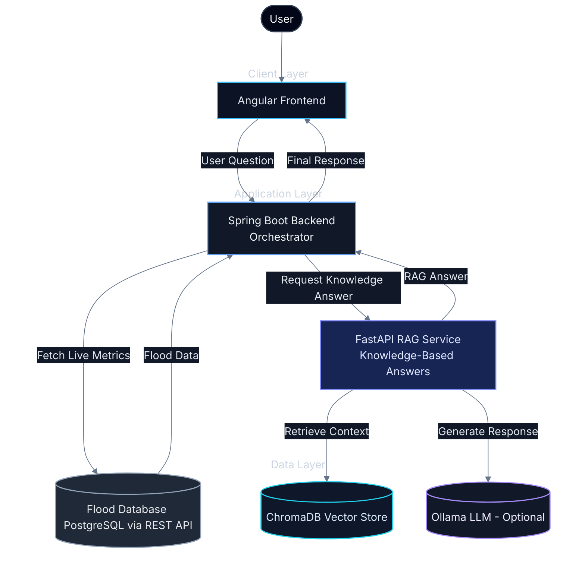
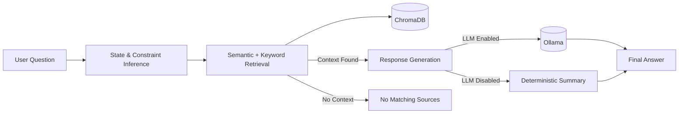
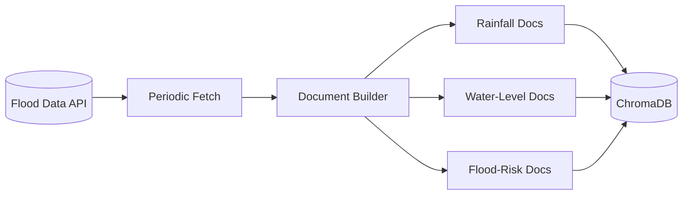

# HydroIntel MY: Malaysia Flood Intelligence Assistant

HydroIntel MY is a full-stack flood intelligence system that combines:
- Deterministic hydro analytics (rainfall + river level summaries and heuristic flood risk),
- Retrieval-augmented generation (RAG) over a local vector database,
- Guided chat UI for non-technical users.

It is built as a multi-service architecture:
- `infobanjir-frontend` (Angular + Nginx)
- `infobanjir-api` (Java 17 + Spring Boot orchestration API)
- `infobanjir-rag` (Python FastAPI + ChromaDB vector retrieval + LLM-Based Responses)

## Live Demo

- Demo URL: `http://ec2-54-169-123-68.ap-southeast-1.compute.amazonaws.com/`
- Public demo note:
  - This deployment is an early preview and still under active iteration.
  - The public environment runs in limited mode with conservative defaults due to deployment cost constraints.
  - LLM generation is disabled in the live demo (`RAG_USE_LLM=false`), so responses are retrieval/deterministic-first rather than fully generative.
  - Outputs are operational guidance and heuristic summaries, not official flood warnings.

## Why This Project

- Converts live flood observations from the flood monitoring system which I have built into readable operational insights.
- Supports both direct metric queries and context-style questions.
- Demonstrates end-to-end engineering of frontend, backend orchestration, RAG, ingestion, and cloud deployment.


## Architecture



## RAG Query Pipeline



## Ingestion Pipeline for RAG Document Generation



## Core Capabilities

- Flood risk estimation from latest rainfall + river-level signals.
- State-aware rainfall and river-level summaries.
- Hybrid answer strategy:
  - Deterministic path for operational flood related queries,
  - RAG path for knowledge and context queries.
- Auto-ingestion from upstream API into ChromaDB with periodic refresh.
- Graceful fallback behavior when dependent services are unavailable.

## Tech Stack

- Frontend: Angular 17, TypeScript, Nginx
- API: Java 17, Spring Boot, Spring MVC, RestTemplate, Maven, JUnit 5
- RAG: Python 3.11, FastAPI, ChromaDB, sentence-transformers, uvicorn
- Deployment: Docker, Docker Compose, AWS EC2
- Data Source: upstream REST API backed by PostgreSQL

## Repository Structure

```text
.
|- infobanjir-frontend/   # Angular app + Nginx runtime proxy/env injection
|- infobanjir-api/        # Spring Boot orchestration API
|- infobanjir-rag/        # FastAPI RAG service + ingestion + vector store logic
|- docker-compose.yml     # Multi-service local/prod-style orchestration
`- aws.env.template       # Environment variable template
```

## Quick Start (Docker Compose)

### 1) Prepare env file

```bash
cp aws.env.template aws.env
```

Adjust values as needed in `aws.env`:
- `APP_MODE=auto`
- `RAG_USE_LLM=false` (recommended for lightweight deployment)
- `CHROMA_HOST_PATH=./.data/chroma` (or an EBS-backed path in EC2)

### 2) Build and run

```bash
docker compose --env-file aws.env up -d --build
```

### 3) Verify services

```bash
docker compose --env-file aws.env ps
curl http://localhost/api/health
curl http://localhost/rag/health
curl http://localhost/rag/stats
```

Frontend should be available at:
- `http://localhost` (or the host/port you mapped via `FRONTEND_PORT`)

## Local Development (Without Docker)

### Frontend

```bash
cd infobanjir-frontend
npm install
npm start
```

### API

```bash
cd infobanjir-api
./mvnw spring-boot:run
```

Windows:

```powershell
cd infobanjir-api
.\mvnw.cmd spring-boot:run
```

### RAG

```bash
cd infobanjir-rag
python -m venv .venv
source .venv/bin/activate
pip install -r requirements.txt
uvicorn app.main:app --reload
```

Windows:

```powershell
cd infobanjir-rag
python -m venv .venv
.\.venv\Scripts\Activate.ps1
pip install -r requirements.txt
uvicorn app.main:app --reload
```

## API Usage

### Ask endpoint (main entrypoint)

`POST /api/ask`

Request:

```json
{
  "question": "What is the flood risk in Selangor today?"
}
```

Response shape:

```json
{
  "status": "success",
  "data": {
    "answer": "Estimated flood risk in SEL is Moderate ...",
    "mode": "auto",
    "confidence": 0.85,
    "latencyMs": 320,
    "requestId": "....",
    "timestamp": "...."
  },
  "timeStamp": "....",
  "requestId": "...."
}
```

### Useful health/debug endpoints

- `GET /api/health`
- `GET /rag/health`
- `GET /rag/health/llm`
- `GET /rag/stats`
- `GET /rag/stats/by-state`
- `GET /rag/ingest/status`

## RAG and Vector Store Notes

- ChromaDB persists to `CHROMA_PERSIST_DIR` inside container and maps to `CHROMA_HOST_PATH` on host.
- Auto-ingestion runs on startup and refreshes every `AUTO_INGEST_REFRESH_SECONDS`.
- Default ingestion behavior replaces existing collection content per refresh (`replace=True`) to keep local KB aligned with latest upstream snapshots.
- Retrieval combines semantic similarity + keyword matching with configurable:
  - `RAG_TOP_K`
  - `RAG_MIN_SCORE`

## LLM Mode

- Local LLM via Ollama:
  - set `RAG_USE_LLM=true`
  - configure `OLLAMA_BASE_URL` and `OLLAMA_MODEL` (default `mistral`)
- If LLM is disabled/unavailable, the system falls back to deterministic summary generation from retrieved context.

## Deployment Notes (AWS EC2)

- Deploy with Docker Compose on EC2.
- Persist ChromaDB on a durable host path (prefer EBS-backed directory).
- Expose only frontend publicly; keep internal service communication container-to-container.
- If using CloudFront in front of EC2, ensure `/api/*` and `/rag/*` routes are forwarded correctly with non-cached dynamic behavior.

## Testing

API:

```bash
cd infobanjir-api
./mvnw test
```

RAG:

```bash
cd infobanjir-rag
pytest
```
